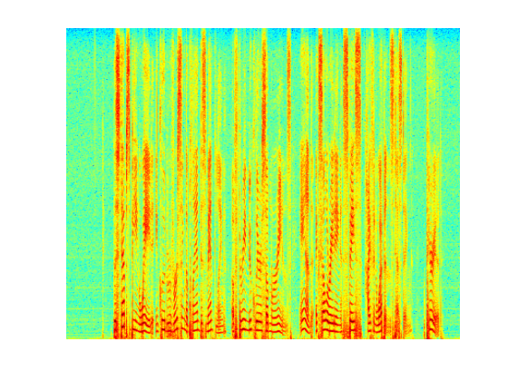

# RecallNet
We propose a novel model called RecallNet for speech enhancement.
Prosposed RecallNet allows to listen to the noisy speech for multiple times and store the information each listening in the external memory.
The stored information will be attended over during the last time of listening and help to enhance the quality of speech.
In our experients, we consider only two times of listening. 

## Setting
- Hardware:
	- CPU: Intel Core i7-4930K @3.40 GHz
	- RAM: 64 GB DDR3-1600
	- GPU: NVIDIA Tesla K20c 6 GB RAM
- Tensorflow 0.12
- Dataset
	- Wall Street Journal Corpus
	- Noises are collected from [freeSFX](http://www.freesfx.co.uk/soundeffects/) and [AudioMicro](http://www.audiomicro.com/free-sound-effects)

## Result
- An example of mixed signal and demixed signals by DNN, LSTM, NTM and RecallNet

|||
|:------------------------------------:|:--------------------------------------:|
|Mix signal                            |Clean signal                            |
|||
|:---------------------------------------:|:------------------------------------:|
|Demixed signal (RecallNet)               |Demixed signal (NTM)                  |
|||
|:------------------------:|:--------------------------:|
|Demixed signal (LSTM)     |Demixed signal (DNN)        |

- STOI measure on bus and caf noises

|||
|:------------------------:|:--------------------------:|
|Seen speakers             |Unseen speakers             |

